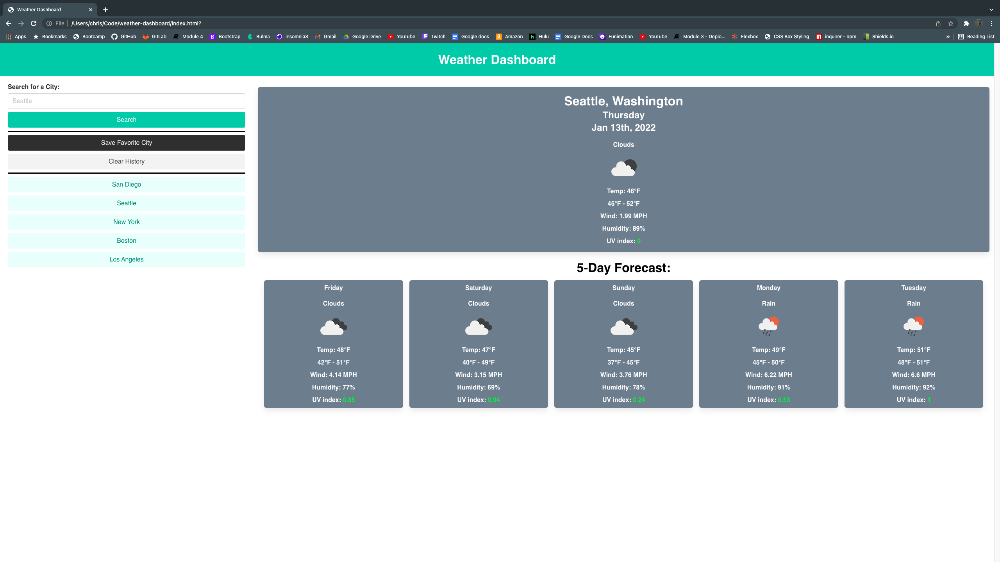

# Weather Dashboard

# Table of Contents

* [Description](#description)

* [Links](#links)

* [Picture](#picture)

* [License](#license)

* [Questions](#questions)

# Description

The user can search for a city and the page should render the current weather and the week's forecasted weather for the searched city. The user may save a favorite city that will stay upon initial page load, and search from a search history of cities they have previously inquired about. The user may clear their saved city and search history to remake them as well.

# Links

[planner Github URL](https://cavazosdotcom.github.io/weather-dashboard/)

[planner Github Repo URL](https://github.com/cavazosdotcom/weather-dashboard)

# Picture

# License

This project does not have a license

# Questions
If you have any questions feel free to contact me at either [Github](https://github.com/cavazosdotcom), or [cavazosdotcom@gmail.com](cavazosdotcom@gmail.com)

